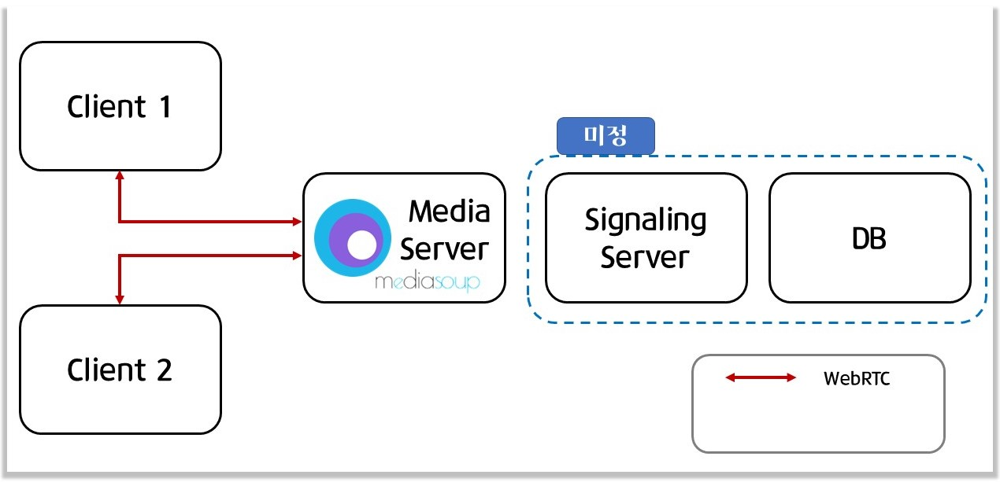
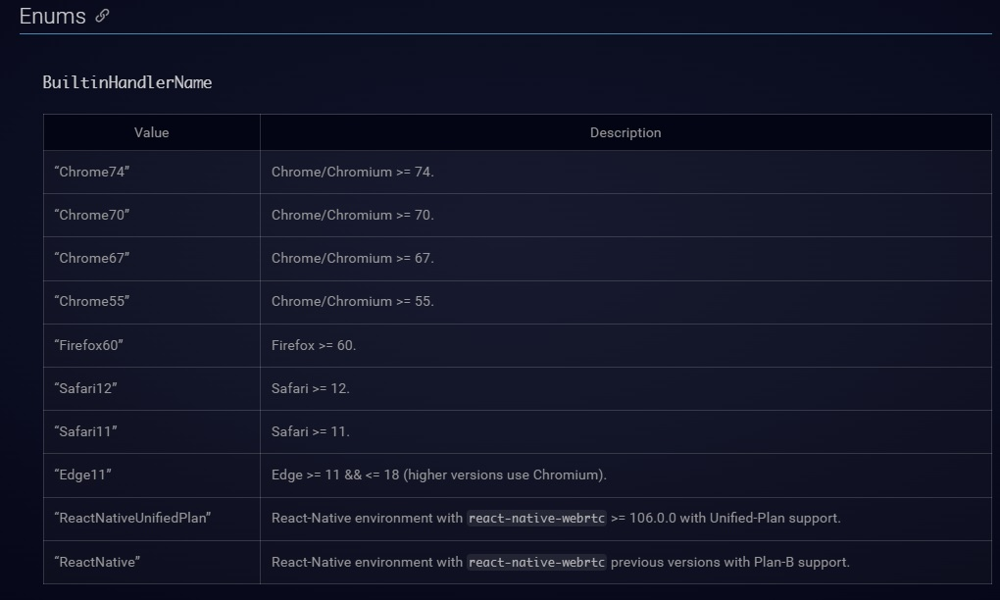

# 미디어 서버(시그널링 서버)
## **1. 역할**

|**서비스**|**역할**|
|:------:|:---|
|`미디어 서버`| 1. SFU 방식의 서버를 사용하여 <br>**클라이언트의 부하 감소** <br>2. WebRTC를 이용한 화상채팅 및 음성채팅 제공<br>|
|`시그널링 서버`| 1. 사용자간의 연결성 파악<br>2. 사용자의 현재 위치정보를 제공 및 저장|


<br>

## **2. 기술스택**
---
* Node.js 18.12
* socket.io
* WebRTC
* [Mediasoup v3](https://mediasoup.org/documentation/v3/mediasoup/installation/#requirements)
* Mediasoup-client
* bundle.js
* `DB는 아직 정하지 못했음`
<br><br>
실시간 테스팅을 위해 사용

  * [watchify](http://watchify.org/)
  
<br>

## **3. 아키텍처**
---


<br><br><br> 


## **4. 기능**
---
|**제공 기능**|**설명**|
|:------:|:---|
|**유저 상태<br> 파악**| 1. 웹 소켓 설정을 통해 방 입장 및 퇴장을 관리 <br>2. 입장한 방의 유저들간의 P2P연결 진행<br>3. |
|**정보 저장**| - 방의 갯수, 유저간의 연결 상태를 NoSQL형식으로 저장<br>|
| 추가 <br>기능 | 기능 설명 ... |

<br>

## **4.0 설치 순서**
---
  ## 1. 기본 요구사항
  - node version >= v16.0.0
  - python version >= 3.6 with PIP
  - GNU make
  ## 2. OS 별 주의사항
  1. Mac, Linux<br>
    - gcc and g++ >= 4.9 or clang (with C++11 support) <br>
    - cc and c++ commands to use gcc/g++ or clang/clang++ executables.
  2. Window<br>
   - GNU make 를 [MinGW](https://sourceforge.net/projects/mingw/)로 다운받아야함<br>
    - 기본 building tool 선택후 설치<br>
   - ISRG Root X1 (Local Computer에)다운받아서 SSL 인증 받아두기<br>
    - https://letsencrypt.org/certs/isrgrootx1.der
  ## 3. requirements.txt 에 있는 python 모듈 설치
  - pip install -r requirements.txt
  - Mac, 및 Ubuntu 환경에서는 파이썬 에러가 발생하는지 파악못함
  ## 4. npm insatll --save mediasoup mediasoup-client 진행
  - 일반적으로 Building 문제가 대다수
  - windows 에는 python 설치에러 발생할 수 도 있음
    - App execution aliases - 앱 별칭관리에서 **python 관련 한 것들 다 off**
  ## 5. Openssl 로 인증서 수동생성 
  - [인증서 수동생성 방법](https://www.ssl.com/ko/%EB%B0%A9%EB%B2%95/openssl%EC%9D%84-%EC%82%AC%EC%9A%A9%ED%95%98%EC%97%AC-%EC%9D%B8%EC%A6%9D%EC%84%9C-%EC%84%9C%EB%AA%85-%EC%9A%94%EC%B2%AD-csr%EC%9D%84-%EC%88%98%EB%8F%99%EC%9C%BC%EB%A1%9C-%EC%83%9D%EC%84%B1/)
  - Key 명은 입력 전, config.example.js 확인 바람 (최종적으로 사용해야할 key의 명칭도 있음)
  - 생성한 Key는 ./server/certs/에 저장
  <br>

  ## 6.0 npm i 이용하여서 module 설치
  ## 6.1 npm start를 이용하서 실행

<br><br><br>

## **4.1 기능 설명**
---
### Server 쪽

현재 서버 쪽에서 NoSQL 방식으로 저장하는 data는 총 5가지

|**데이터**|**설명**|**저장 방식**|
|:--------:|:-----------:|:-------|
|Rooms|존재하는 룸의 {Router, 및 peers의 ip}|{ roomName1: { Router, peers: [ socketId1, ... ] }, ...}|
|Peers|Peer의 IP 정보에 따른, Room의 위치, socket 그리고 peer들의 정보`(Workers의 id인지 제공자의 id인지는 확인해봐야함)`|{ socketId1: { roomName1, socket, transports = [id1, id2,] }, producers = [id1, id2,] }, consumers = [id1, id2,], __ }, ...}|
|Transports|:-------|[ { socketId1, roomName1, transport, consumer }, ... ]|
|Producers|Client가 접속했을 때, producers의 정보|[ { socketId1, roomName1, producer, }, ... ]|
|Consumers|Client가 meida를 제공해줘야할 Consumer의 정보|[ { socketId1, roomName1, consumer, }, ... ]|


<br> 


  ### 1. **방 입장**


  ### client

  ```
  const joinRoom = () =>{ // to make router or go to router
    socket.emit('joinRoom', {roomName}, (data) => {
      ...
      createDevice()
    })
  }
  ```

   - joinRoom을 emit 이후 CreateDevice() 진행
  ### server 


  ```   
  socket.on('joinRoom', async({roomName}, callback) => 
  {
    // create router if room is note exist
    ... 방 생성

    }
    // get Router RTP capabilities
    const rtpCapabilities = router1.rtpCapabilities
    callback({rtpCapabilities})
  })
  ```
  - createRoom 함수를 통해 
    1. 방이 있을 경우 : Rooms 에 저장된 Router id를 통해 입장
    2. 방이 없을 경우 : Rooms 에 Router id를 저장 후 방을 생성


### 2. **전송 장치 생성**

### client
```
const createDevice = async () =>{
  try{
    ...
    createSendTransport() // everyone is producer & consumer
  }catch (error)
  {...}
}

const createSendTransport = async ()=>{
  // 1. 'createWebRTCTransport' server로 전송
  await socket.emit('createWebRTCTransport',{consumer : false}, ({params})=>{
    
    ... Producing할 device 생성

  // 2. 'connect' mediasoup 의 transports에 connect 신호를 받고,
  //    'transport-connect'를 server로 전송
        await socket.emit('transport-connect',{...})

    )

    producerTransport.on('produce', async(parameters, callback, errback) =>{
      try{

        // Room에 Producer가 있으면, router를 생성할 필요가 없기 떄문에 
        // Producer가 있는지 물어봄
        await socket.emit('transport-produce',{},  

        ({id, producerExist}) => {
          // callback을 통해 Room 내부의 producers의 정보를 받아옴
          callback({id, producerExist})
          if(producerExist){
            getProducers() // -> consumer 정보를 받기 위해 getProducers진행
          }

        })}catch(error){...}})

    connectSendTransport() // -> streaming 정보 connect 시키기
  })
}
```
### server
```
socket.on('createWebRTCTransport',async({consumer}, callback)=>{
    // have to get room name from peer's properties

    ... 연결된 router의 정보 받아옴

    createWebRTCTransport(router).then(
            ...
            addTransport(transport, roomName, consumer) // server의 transports 정보 저장
        },
        error => {
            console.log(error.message)
        }
    )
})


socket.on('transport-produce',async({kind, rtpParameters, appData}, callback) =>{

    ... producer생성 및 roomName 정보 받아옴

    addProducer(producer, roomName) // server의 Producing하는 streaming 정보를 
    informConsumer(roomName, socket.id, producer.id) // 각각의 producer에게 new-producer 정보를 전송

    producer.on('transportclose', ()=>{...})
    callback({
      Producer 정보와 Room 에 producer 유무를 callback
    })
})

```

<br>


## **5.1 구현 정도**
---
1. 방 입장 기능 구현 (room 정보에 따라 입장하는 방이 다름)

2. 입장한 방에 따라 유저간의 정보 통신 시작

3. 영상 정보 전송 
    - 오디오 정보 미구현
    - 화면 공유 미구현

4. 버튼을 이용한 Streaming, Finishing 구현

5. Room의 개수 및 Peers의 상태 저장
<br><br>

## 추가 필요: 
<br>1. workers를 늘려야 서버에 대한 부하가 줄어든다. - 이에 대한 정보를 좀 찾아보자
<br>2. mediasoup handler를 이용하여 다른 부라우저간의 연결성도 확보해두자
<br>3. 에러사항 7.과 관련이 있는데, enable로 처리를 하면 계속 녹화가 진행된다.. close후 refresh 하는 방법을 알아봐야함.

<br>4. 화면공유 및 음성에 대한 정보도 전송을 할 수 있어야한다.
<br>5. txtConnection을 이용하여 로딩중 화면을 보여줄 수 있도록 작업

<br>

## **5.2 에러 사항**
---
1. ~~Ctrl + C, Ctrl + V 로 방에 입장 시 error 발생~~ <br>23.01.24 update - 버튼이 구현되면서 에러가 발생하지 않게됨<br>->(새로고침 및 ctrl +c, v 하면서 media정보 전송에 문제가 있었는듯)
2. ~~현재 영상이 모든 방 포함 최대 2개까지만 공유됨~~ 23.01.23 update 
3. ~~퇴장시 영상정보 삭제가 안됨~~ 23.01.22 update 
4. 에러 이후 server복구가 안 됨 <br> -> 에러 발생사항 확인 중
5. Edge로 들어가면 접근이 안 됨 -> 핸들러와 관련이 있음<br>(다른 브라우저들은 조사해봐야함)

    - API는 [mediasoup - client](https://mediasoup.org/documentation/v3/mediasoup-client/api/) 참조 바람
<br>

6. 여러 User가 Publish를 연속적 빠르게 하면, Consumer 화면이 검은색 화면으로 출력됨
7. ~~Finish를 하면 화면이 종료가 안되는 현상 발생~~ 23.01.25 update - 다시 검은화면으로 변경됨
8. Streaming 중 간헐적으로 publish 혹은 Finish를 누르면 error 가 발생함 <br>-> try{}catch{}로 잡기 때문에 피해는 안가는 것으로 보임

<br>


<총 진행 상황>


<br>

## **6. Media soup 사용한 이유**
---
**1. LowLevel의 API로 업데이트 및 변경이 간단**<br>

**2. SFU방식을 채택한 오픈소스로 서버 제작의 부담을 줄여줌.**<br>

**3. WebRTC 중 Object를 사용하는 ORTC 사용**
  - 사용자의 위치정보를 보다 간단하게 받아올 수 
  있음
  - object의 조작 및 접근이 용이

**4. 접근 방식에 변형을 주면 Signaling Server로 사용가능**
  - 디스코드는 버튼을 이용하여 Room을 이동
    - 버튼을 누르기 전까지는 유저간의 연결성이 없음
    - 즉, 버튼을 누르기 전까지 유저의 위치를 추적가능
<br>


## **7. 주의사항** 
---
1. Openssl을 이용해서 인증서를 깔아둬야함
* use #openssl req# to get key.pem & cert.pem 
* https 를 기반으로 해서 그런지
<br>default설정을 조정을 안해서 그런지 파악은 안 되지만,<br>인증서가 없으면 실행이 안 됨

2. Mediasoup **`설치가 까다로우니`** referenc를 잘 참조허여 설치하기 바람
<br>

### **Reference**
---
* [WebRTC Overview](https://trembit.com/blog/webrtc-media-servers-overview-and-explanation-what-to-choose/)
* [WebRTC 이론](https://millo-l.github.io/series/WebRTC-%EC%9D%B4%EB%A1%A0%EB%B6%80%ED%84%B0-%EC%8B%A4%EC%A0%84%EA%B9%8C%EC%A7%80)
* [Mediasoup API](https://mediasoup.org/documentation/v3/mediasoup/api/)
* [Mediasoup-client API](https://mediasoup.org/documentation/v3/mediasoup/api/)
* [소켓통신 - DOCS](https://socket.io/docs/v4/)